# AI Glasses Development Guide

*A step-by-step guide for setting up and building AI Glasses apps using Android Studio and the Android XR emulator.*

---

## Table of Contents
1. [Section 1: Prerequisites & Setup](#section-1-prerequisites--setup)
2. [Section 2: SDK Setup](#section-2-sdk-setup)
3. [Section 3: Quick Start from a GitHub template](#section-3-quick-start-using-the-template-repo)
4. [Section 4: Creating an AI Glasses Project](#section-4-creating-an-ai-glasses-project)
5. [Section 5: Project Dependencies & Gradle Config](#section-5-project-dependencies--gradle-config)
6. [Section 6: Android Virtual Device (AVD) Creation](#section-6-android-virtual-device-avd-creation)
7. [Section 7: Running the App](#section-7-running-the-app)
8. [Section 8: Developer Tips](#section-8-developer-tips)

---

## Section 1: Prerequisites & Setup

To develop for AI Glasses, you must use **Android Studio Canary**.

1. **Download Android Studio Canary:**
   - Navigate to the [Android Studio Preview release page](https://developer.android.com/studio/preview).
   - Download the latest **Canary** build *(Note: Do not use the Stable or Beta builds)*.
   - Install the application.

---

## Section 2: SDK Setup

### 1. Install SDK 36

1. Open **Android Studio Canary**.
2. Click on **Settings** in the bottom left corner.
3. Navigate to **Languages & Frameworks > Android SDK**.

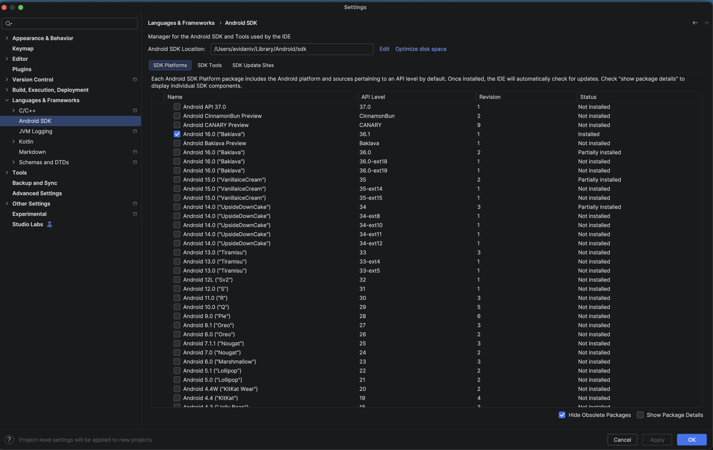

4. Under the **SDK Platforms** tab, ensure you have installed an SDK with a minimum **API Level of 36**.
5. Switch to the **SDK Tools** tab and check the boxes for the following components:
   - **Android SDK Build-Tools**
   - **Android Emulator**
   - **Android SDK Platform-Tools**
   - **Layout Inspector image server for API 31-36**

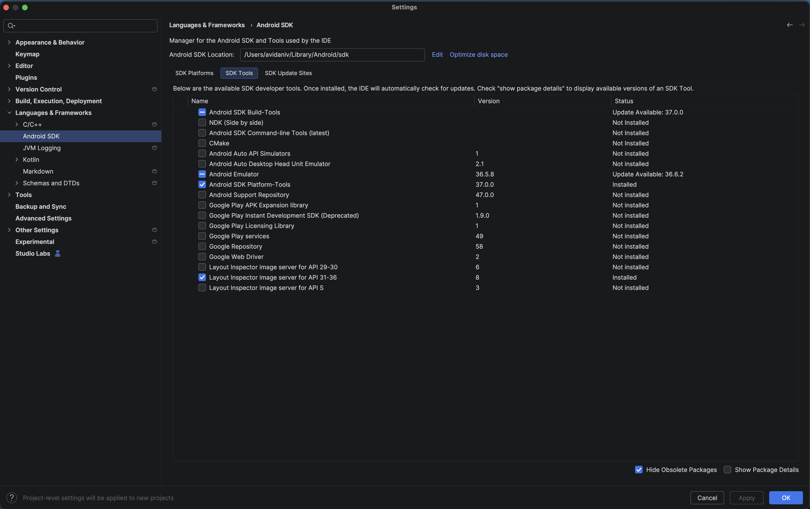

6. Click **Apply** to download and install the components.

---

## Section 3: Quick Start: Using the Template Repo

Now that your environment is ready, you can either clone the pre-configured template or set up a project manually.

If you don't want to configure a project manually from scratch, you can clone the pre-configured repo:
1. Go to https://github.com/wearable-devices/AndroidAIGlassesTemplate
2. Copy the repo URL and run: `git clone https://github.com/wearable-devices/AndroidAIGlassesTemplate.git`
3. Open the cloned folder in Android Studio Canary.

*(Note: If you clone this repo, you can skip straight to **[Section 6: Android Virtual Device (AVD) Creation](#section-6-android-virtual-device-avd-creation)**, as the code and dependencies are already configured!)*

After cloning, rename the project to match your app:

4. **App name:** Open `app/src/main/res/values/strings.xml` and update the `app_name` value.
5. **Package name:** In Android Studio, right-click the `com.example.template` package → **Refactor > Rename** and enter your new package name. Android Studio will update all references automatically.
6. **Application ID:** Open `app/build.gradle.kts` and update the `applicationId` field to match your new package name.

---

## Section 4: Creating an AI Glasses Project
1. In Android Studio Canary, click on **File > New > New Project**.
2. On the template list go to  **XR**.
3. Choose **Basic AI Glasses Activity**

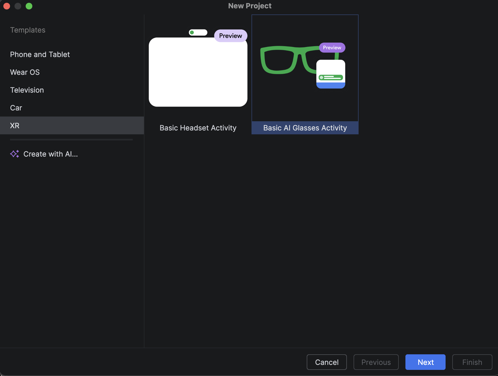

4. Click **Next**
5. Click **Finish**

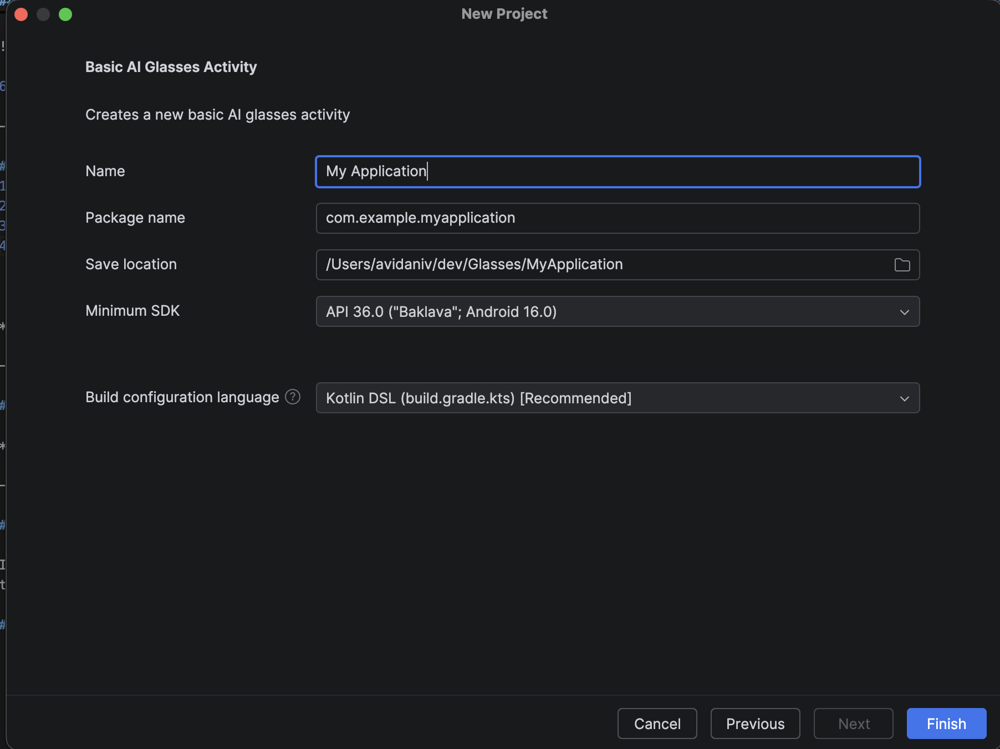

---

## Section 5: Project Dependencies & Gradle Config

Update the project dependencies to match the required AI Glasses libraries:

### 5.1. libs.versions.toml

1. Under the **Gradle Scripts** group, open `libs.versions.toml`.
2. In the `[versions]` block, update the existing variables to the following versions:

```toml
glimmer = "1.0.0-alpha08"
projected = "1.0.0-alpha05"
```

3. At the bottom of the `[versions]` block, add:

```toml
xrRuntime = "1.0.0-alpha11"
xrArcore = "1.0.0-alpha11"
```

4. In the `[libraries]` block, add the following dependencies:

```toml
androidx-xr-runtime = { group = "androidx.xr.runtime", name = "runtime", version.ref = "xrRuntime" }
androidx-xr-arcore = { group = "androidx.xr.arcore", name = "arcore", version.ref = "xrArcore" }
```

### 5.2. app/build.gradle.kts

1. Open the module-level `build.gradle.kts` (Module: app).
2. Inside the `dependencies` block, add the new XR libraries you just defined:

```kotlin
dependencies {
    // ...existing dependencies...
    implementation(libs.androidx.xr.runtime)
    implementation(libs.androidx.xr.arcore)
}
```

3. Click **Sync Now** At the top of the page to download the new Gradle configuration.
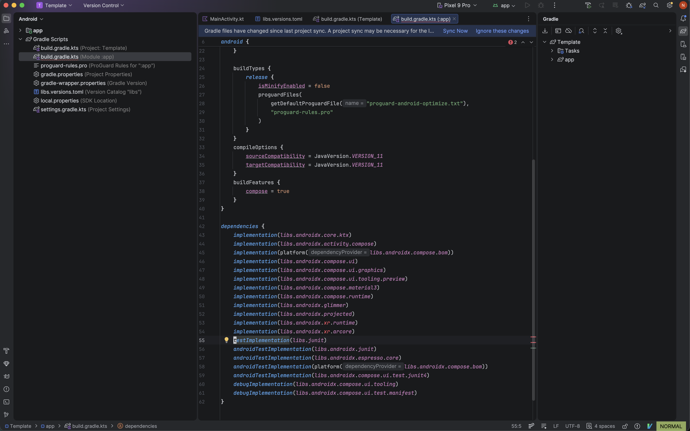

### 5.3. AndroidManifest.xml

1. Open `app/manifests/AndroidManifest.xml`.
2. Locate the following attribute inside your `<activity>` tag (which is located inside `<application>`):

```xml
android:requiredDisplayCategory="@string/display_category_xr_projected" >
```

3. Remove the `@string/display_category_` prefix so the attribute explicitly uses the `"xr_projected"` string instead:

```xml
android:requiredDisplayCategory="xr_projected" >
```

---

## Section 6: Android Virtual Device (AVD) Creation
In order to test and run your app on the emulator, you will need to create an **Android Virtual Device (AVD)** for both the phone and the AI Glasses.

### 6.1. Host Phone AVD

Because AI Glasses act as a paired companion device, you must first create a standard mobile phone AVD to host the connection.

1. Go to **View -> Tool Windows -> Device Manager**
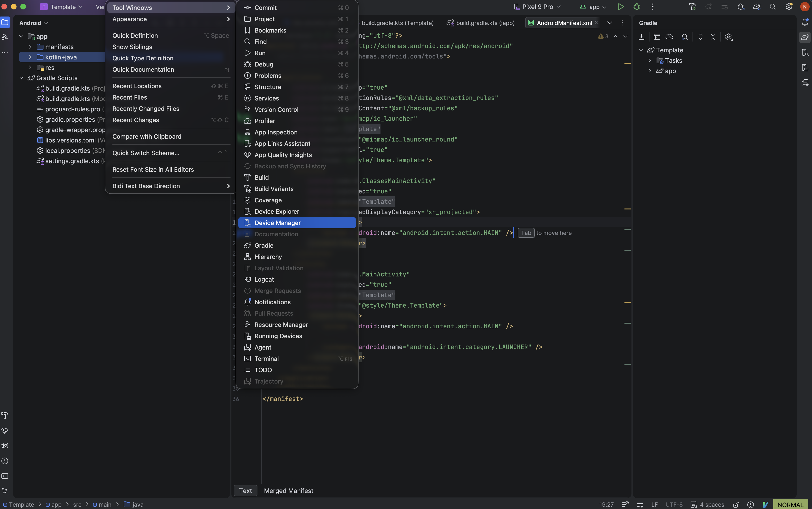
2. Click **Create Virtual Device** (the `+` icon).
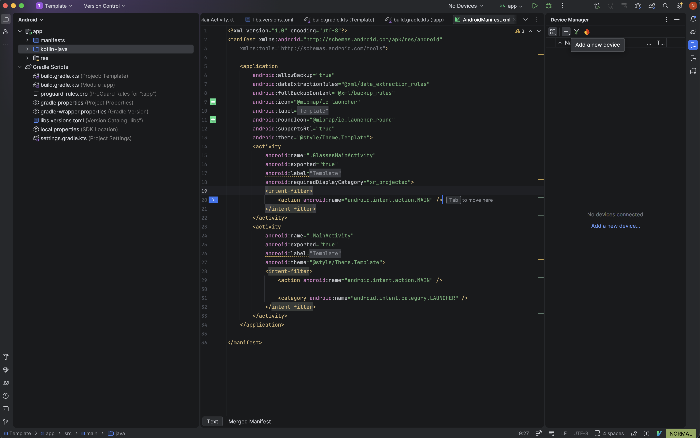
3. Click **Create Virtual Device**
4. Under the **Phone** category, select a modern device profile (like a Pixel 9 Pro).
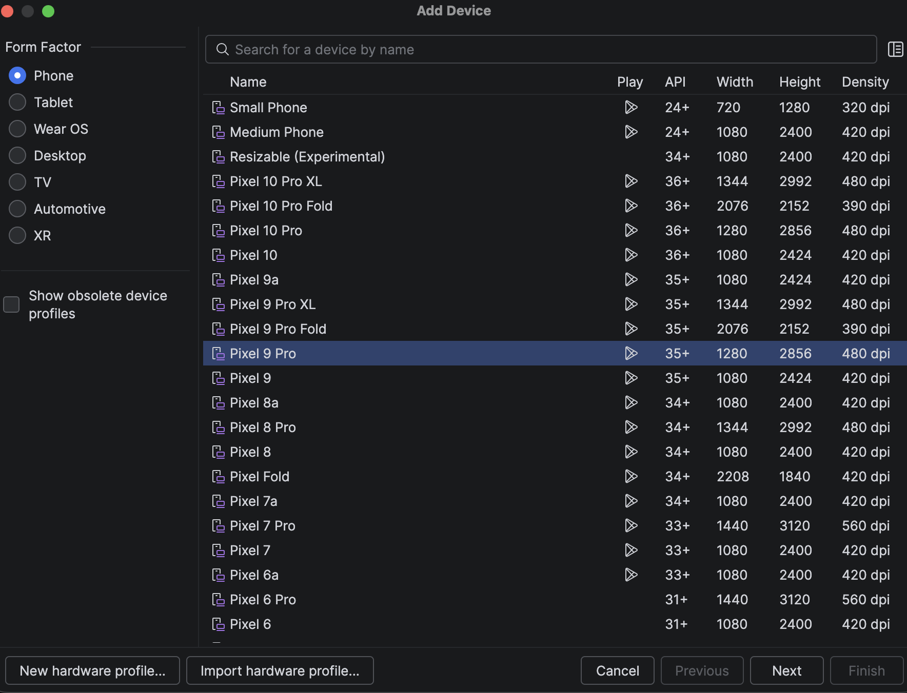
5. Click **Next**
6. Under the API selection dropdown choose **Show All**.
7. For the system image, select the **CANARY** (or API 36 / Baklava) build:
   - **For Mac (Apple Silicon):** Choose the `arm64-v8a` system image.
   - **For Windows / Intel Macs:** Choose the `x86_64` system image.
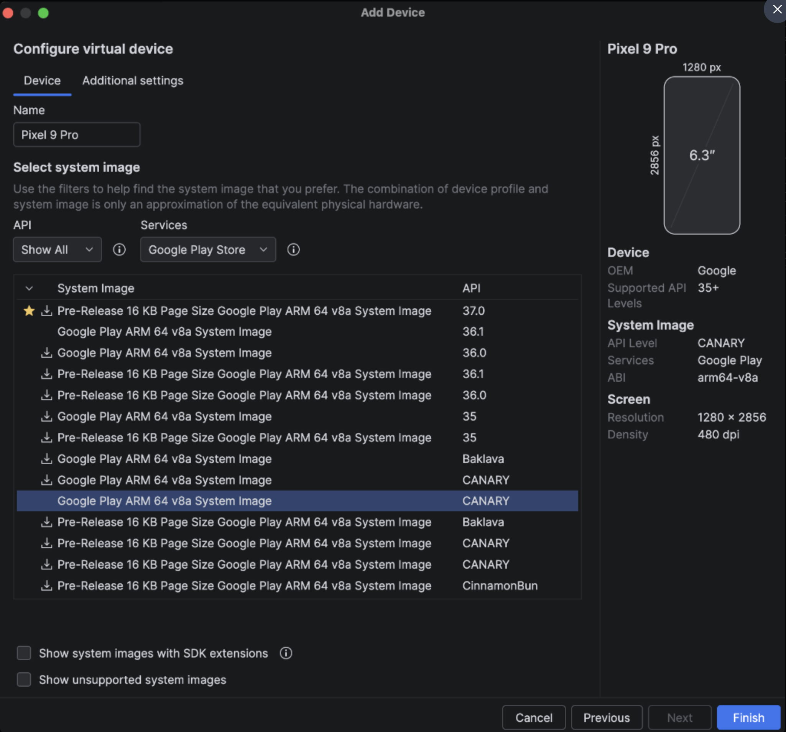
8. Click **Finish**.

### 6.2. AI Glasses AVD

Now, create the companion emulator for the glasses themselves:

1. Go to **View -> Tool Windows -> Device Manager**

2. Click **Create Virtual Device** (the `+` icon).

3. Click **Create Virtual Device**
4. In the device category list, locate and select the **XR** category.
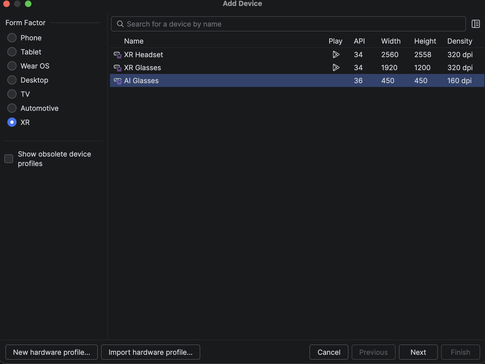
5. Click **Next**
6. In the system image selection page leave everything as is.
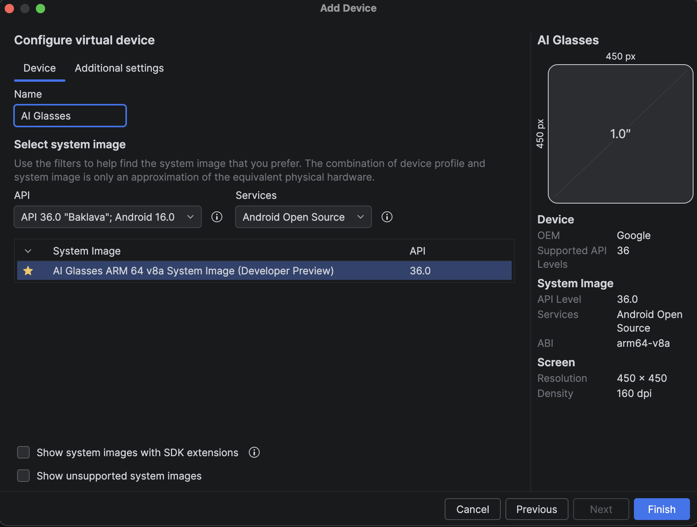
7. Click **Finish**


### 6.3. Pairing the AVDs

1. Launch **both** the Phone AVD and the AI Glasses AVD from your **Device Manager** by clicking the **Run** (Play) button.
2. Still in the **Device Manager**, click the three dots next to the **AI Glasses** AVD and click **Pair Glasses**.
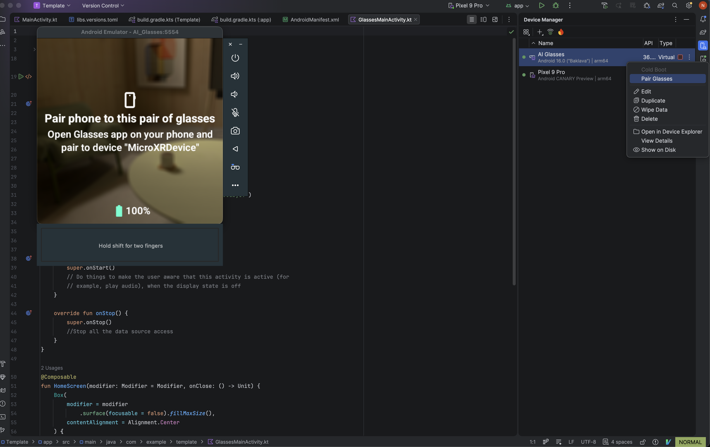
3. Choose your **Phone AVD** and click **Next**.
4. Follow the steps inside the **Companion App** on the **Phone AVD** to complete the pairing.

---

## Section 7: Running the App

With your devices paired, you can now run your application on the emulator!

1. At the top of the Android Studio window, ensure your **app** module is selected in the run configuration dropdown.
2. For the target device, select the **Phone AVD** (the host device you just set up).
   *(Note: The app is installed and run on the host phone, which then drives the experience on the connected glasses).*
3. Click the green **Run** (Play) button.
4. Wait for the app to build and install. 
5. Press the **Power** button on the glasses emulator.
6. Press the **Launch** button on the **Phone** emulator.
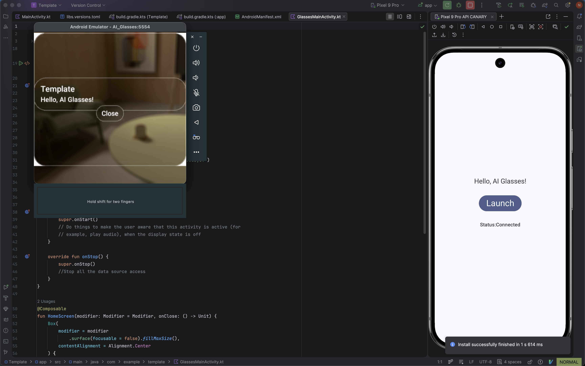

---

## Section 8: Developer Tips

### 1. Removing White Corners and Borders

To remove the default white window background and rounded borders from your main UI:

**Make the Window Background Transparent:**  
In your `GlassesMainActivity.kt`'s `onCreate()` function, right before `setContent`, add:
```kotlin
window.setBackgroundDrawable(ColorDrawable(Color.TRANSPARENT))
```
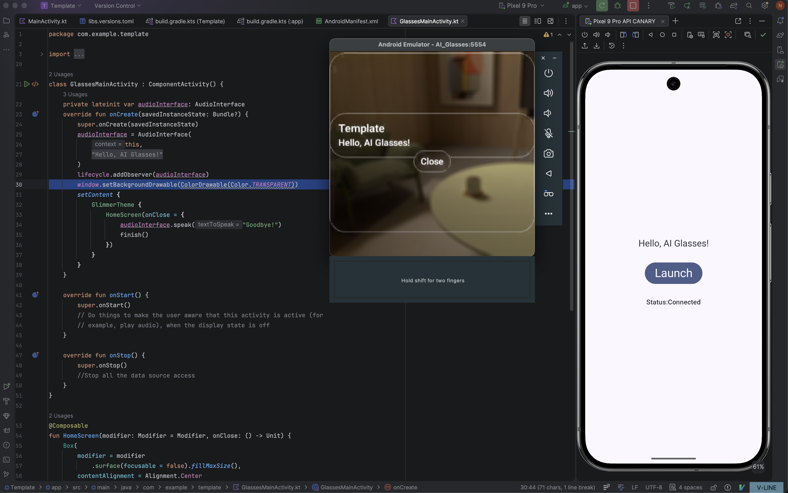

**Remove Borders from your Compose Container:**  
When using Glimmer or Jetpack Compose `Surface` or `Card`, ensure you explicitly set the shape and border:
```kotlin
    Box(
        modifier = modifier
            .surface(focusable = false, border = null).fillMaxSize(),
        contentAlignment = Alignment.Center
    ) {
         // Your UI here
      }
```
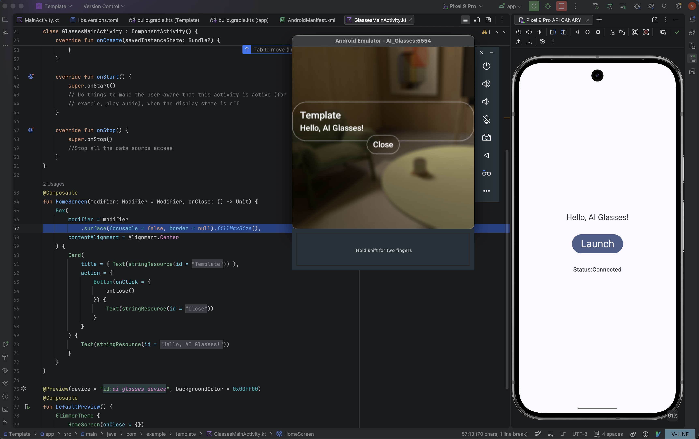

### 2. Keep the Emulator Awake (Disable Sleep Timer)

To prevent the AI Glasses emulator from going to sleep while you are testing (without needing ADB commands), you need to add the `FLAG_KEEP_SCREEN_ON` layout flag specifically to the `ProjectedDisplayController`. 

Follow these steps:

1. Open your `GlassesMainActivity.kt`.
2. Add the `@OptIn(ExperimentalProjectedApi::class)` annotation to your `onCreate` function.
3. In `onCreate()`, use `lifecycleScope.launch` to create the `ProjectedDisplayController` and apply the keep-awake flag.
4. Close the controller in `onDestroy()`.

```kotlin
class GlassesMainActivity : ComponentActivity() {
    
    // 1. Declare the ProjectedDisplayController
    private var projectedDisplayController: ProjectedDisplayController? = null

    @OptIn(ExperimentalProjectedApi::class)
    override fun onCreate(savedInstanceState: Bundle?) {
        super.onCreate(savedInstanceState)
        
        window.setBackgroundDrawable(ColorDrawable(android.graphics.Color.TRANSPARENT))

        // 2. Launch the projected display controller and add the keep-awake flags
        lifecycleScope.launch {
            try {
                projectedDisplayController = ProjectedDisplayController.create(this@GlassesMainActivity)
                projectedDisplayController?.addLayoutParamsFlags(android.view.WindowManager.LayoutParams.FLAG_KEEP_SCREEN_ON)
            } catch (e: Exception) {
                Log.e("GlassesApp", "Failed to create ProjectedDisplayController", e)
            }
        }
        
        setContent {
            // Your UI here
        }
    }

    // 3. Clean up the controller when the activity is destroyed
    override fun onDestroy() {
        super.onDestroy()
        projectedDisplayController?.close()
    }
}
```